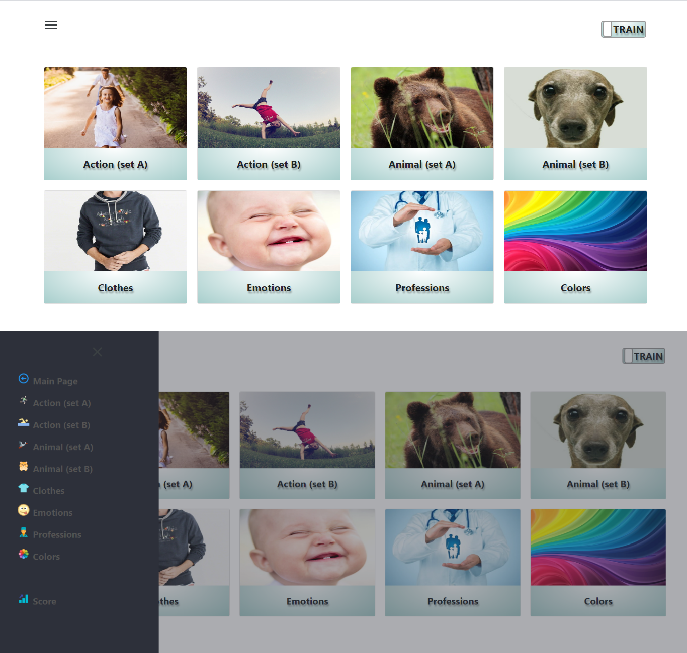

# english-for-kids

### [Link to deploy](https://maxvvellh0use-english-for-kids.netlify.app) 

English language training app on native JS and SASS  

On the project used core js library, webpack and preprocessor SASS

